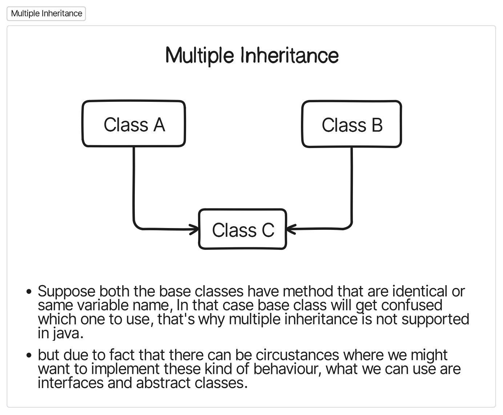
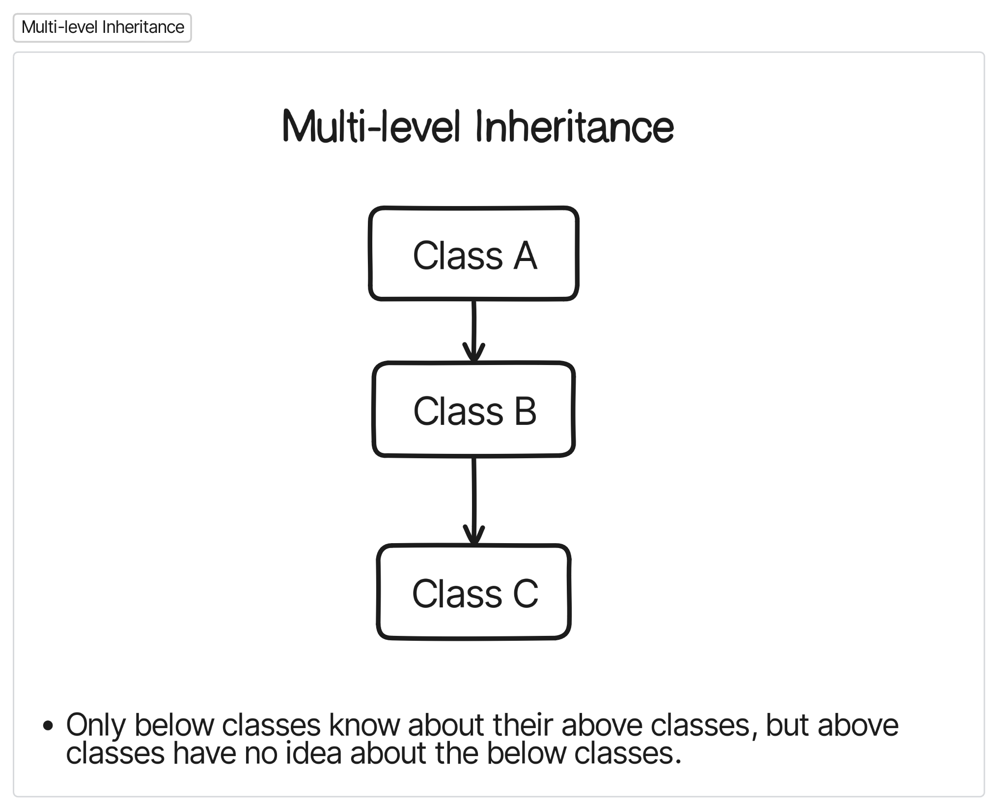

## Inheritance

1. **Child** class can access the **members** of the **base** class until and unless they are not **private**.

2. The **type** of **reference-variable** and not the object that determines what members can be **accessed**.

```java
public class Main {
    public static void main(String[] args) {
        Box box4 = new WeightBox();
        //error - cannot find symbol
        System.out.println(box4.weight);
    }
}
```

> Note: The above rule applies to constructor also

```java
// base or super class
public class Box {
    double l;
    double w;
    double h;

    Box(Box old) {
        this.l = old.l;
        this.w = old.w;
        this.h = old.h;
    }
}

// child class
public class WeightBox extends Box {
    double weight;

    WeightBox(WeightBox other) {
        // prividing weightbox object but accepts box object
        super(other);
        this.weight = other.weight;
    }
}
```

3. Upon calling **super()** inside a **constructor** of a class which has **not inherited** any other **class** gives **no error**. The reason is because every class by default has **Object** as its **superclass**.

```java
public class Box {
    double l;
    double w;
    double h;

    Box(double length,double width,double height) {
        super(); // no error - Object class constructor
        this.l = length;
        this.w = width;
        this.h = height;
    }
}
```

4. **super** can also be used to **explicitly** access the base class members.

5. If the **super class** or base class requires any arguments the child class should pass them to the super() - base class constructor, inside the child class.

6. The **Super class** have no knowledge of the **base class** and but the child class depends on the parent class as it inherits its properties, that's why the super class constructor initializes **first**.

```java
public class WeightBox extends Box {
    double weight;

    WeightBox(double length, double width, double height, double weight) {
        this.weight = weight;

        // error - "call to super() must be first statement in constructor body"
        super(length, width, height);
    }
}
```

### Diagrams For Explanations

- Multiple Inheritance
  

- Multilevel Inheritance
  
