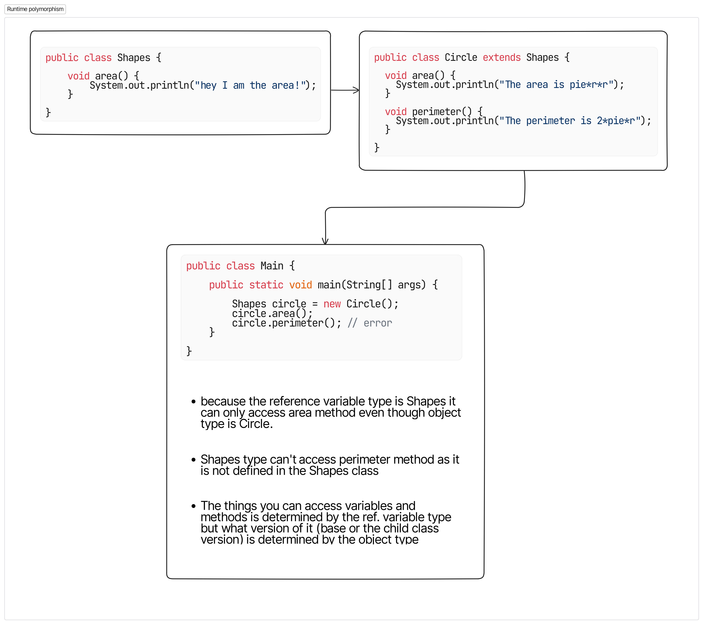

## Polymorphism

### Static / Compile Time Polymorphism

1. Achieved through **Method overloading**.

   > Can also be achieved through **operator overloading** but java dosen't allow that.

   - **Method Overloading** :- Same name but different types, arguments, return types or ordering (types).

2. Java decides which method to run based on the number of arguments provided.

```java
public class Numbers {

    void sum() {
        System.out.println(0);
    }

    void sum(int a, int b) {
        System.out.println(a+b);
    }

    // variable arguments
    void sum(int... nums) {
        int total = 0;
        for (int num:
             nums) {
            total += num;
        }
        System.out.println(total);
    }

    public static void main(String[] args) {
        Numbers num = new Numbers();
        num.sum();
        num.sum(1,2);
        num.sum(1,2,1,2,1,2);
    }
}
```

---

### Dynamic / Run Time Polymorphism

1. Achieved through **Method overriding**.

   - **Method Overriding** :- Everything of a method like name, return type, arguments (number of), their types and their order of passing is exactly same just the **body** of method is **different**.

2. Java decides which method to run at runtime.

3. But **which one to access** in case of **overriden methods** is determined by the **object** (**aka Upcasting**).

   - How java determines which method to run (super or base class version) is by a method known as **Dynamic dispatch method**.

> **Dynamic Dipatch Method**
> It is a mechanism by which a call to an overriden method is resolved at
> runtime rather than compile time.

```java
class Shapes {
    void area() {
        System.out.println("I am a shape");
    }
}
class Circle extends Shapes {
    void area() {
        System.out.println("pie * r * r");
    }
}

public class Main {
    public static void main(String[] args) {
        Shapes shape = new Shapes();
        shape.area(); // "I am a shape"

        Circle circle = new Circle();
        circle.area(); // "pie * r * r"

        Shapes shape2 = new Circle();
        shape2.area(); // "pie * r * r"
    }
}
```

4. By default every class has **Object** as its superclass it contains a **toString()** method, now by declaring your own toString() method you can **change** the default **behaviour** of **println()**.

---

### Static and Final Keyword

#### Final

1. You can use **final** keyword to avoid overriding a method.

   - Methods declared as final can somehow provide **performance enhancement** because the compiler is free to inline the calls to them as the compiler would know that these methods **cannot be overriden**.

   - Because it is determined which method to call at runtime it is also known as **late binding** but because the final method cannot be overriden, a call to one can be resolved at **compile time** also known as **early binding**.

2. Final keyword is also used to prevent inheritance by declaring the class as final. One thing to note is that by declaring a class as final it **implicitly declares all its methods as final**.

#### Static

1. If you define a static method in a class and then if another class inherits this class and try to override it - **it will not be overriden**.

   - Because there's no point in overriding them in the child class because the method in the parent class will **always run** no matter from which object you call it.

> Static methods can be inherited but cannot be overriden, because overriding depends on objects and static dosen't hence static methods cannot be overriden

### Diagrams for explanation

- Dynamic Polymorphism
  
